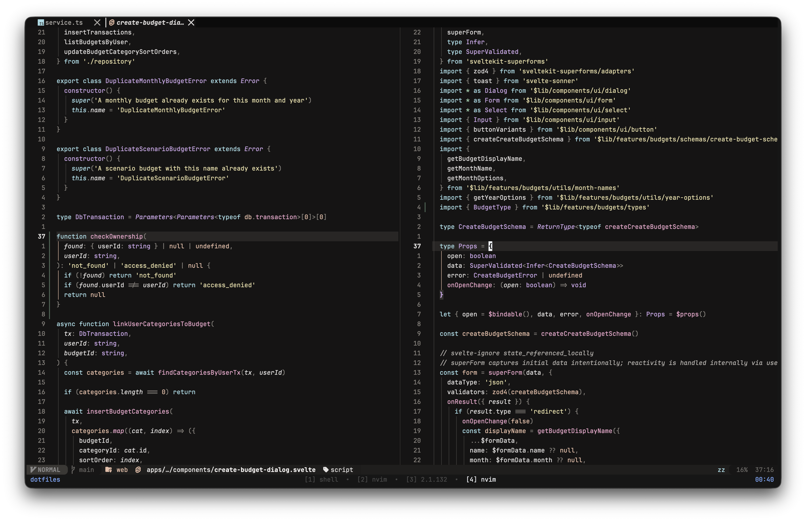

# nyanuwatari

A dark Neovim colorscheme.

## The story

A fusion of two ideas. The charcoal background is inspired by **Susuwatari** — the wandering soot sprites from Studio Ghibli films. The pink and peach accents are inspired by **Nyan Cat**'s pop-tart palette. The rest of the colors — cyan, violet, yellow — were tuned freely to round out the system.

It's a **cyan / pink / violet / yellow**-oriented colorscheme. No greens for syntax (just my weird taste — green is reserved strictly for diff-add, git-add, and string escape edge cases where "addition / success" semantics are unambiguous).

Five-hue chromatic palette at 190° · 275° · 328° · 20° · 50°, warm-biased, AAA contrast throughout.



## Install

Requires Neovim 0.9+ and [`rktjmp/lush.nvim`](https://github.com/rktjmp/lush.nvim).

### lazy.nvim

```lua
{
  "marekh19/nyanuwatari.nvim",
  dependencies = { "rktjmp/lush.nvim" },
  lazy = false,
  priority = 1000,
  config = function()
    vim.cmd.colorscheme("nyanuwatari")
  end,
}
```

### Local development

```lua
{
  dir = "/path/to/nyanuwatari",
  dependencies = { "rktjmp/lush.nvim" },
  lazy = false,
  priority = 1000,
  config = function()
    vim.cmd.colorscheme("nyanuwatari")
  end,
}
```

## Extras (terminals, multiplexers)

Pre-generated configs live in `extras/`:

| Tool       | File                              |
|------------|-----------------------------------|
| Ghostty    | `extras/ghostty/nyanuwatari`      |
| Kitty      | `extras/kitty/nyanuwatari.conf`   |
| Alacritty  | `extras/alacritty/nyanuwatari.yml` (legacy YAML format) |
| WezTerm    | `extras/wezterm/nyanuwatari.toml` |
| Tmux       | `extras/tmux/nyanuwatari.tmux`    |

These are output artifacts — **don't edit them by hand**, they get overwritten on regeneration.

### Regenerating the extras

The extras are built from `lua/nyanuwatari/palette.lua` via [shipwright.nvim](https://github.com/rktjmp/shipwright.nvim). After editing the palette:

```sh
just extras
```

`just` auto-clones `lush.nvim` and `shipwright.nvim` into a project-local `.deps/` directory on first run — nothing touches your system nvim install. Other useful recipes:

| Recipe | What it does |
|--------|--------------|
| `just check` | Headless smoke-test: loads the colorscheme, reports errors |
| `just extras` | Regenerate every file under `extras/` |
| `just fmt` | Run `stylua` over `lua/` and `colors/` |
| `just check-fmt` | Verify `stylua` formatting (exits non-zero if dirty) |
| `just deps-update` | Pull latest `lush.nvim` / `shipwright.nvim` |
| `just deps-clean` | Remove `.deps/` (next run re-clones fresh) |

## Status

Currently MVP:

- ✅ Dark variant
- ✅ Treesitter, LSP semantic tokens, diagnostics
- ✅ Five terminal extras
- ⏳ Light variant
- ⏳ `setup()` config (transparent, italic toggles, custom overrides)
- ⏳ Plugin-specific integrations (Telescope, lualine, cmp, …)

## Credits

- Architecture pattern from [zenbones-theme/zenbones.nvim](https://github.com/zenbones-theme/zenbones.nvim)
- Pipeline via [rktjmp/shipwright.nvim](https://github.com/rktjmp/shipwright.nvim) and [rktjmp/lush.nvim](https://github.com/rktjmp/lush.nvim)
